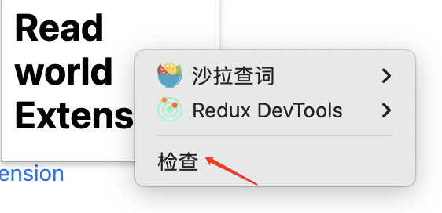
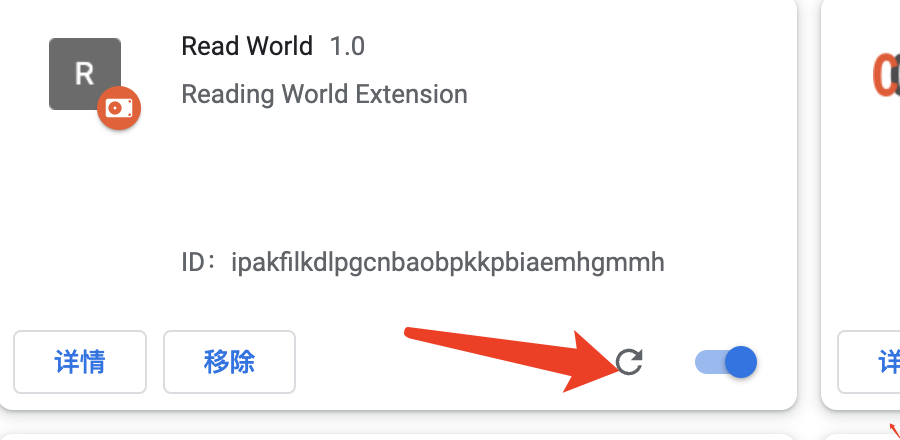

# read world 

## 需求
鼠标选中文案时，在选中文案的右上角位置一个图标（小喇叭），点击小喇叭，读出选中文案的读音。

## 技术调研
1. 怎么判断是否选中文案？

2. 阅读选中文案
使用浏览器自带的方法

### 开发 chrome extension 的流程
#### Chrome extension 是什么？
想 Chrome 浏览器增加特性和功能来增强用户体验

#### 技术
HTML
CSS
JavaScript

#### APIS
- 浏览器提供的所有 JavaScript API
- Chrome 浏览器提供 API
[Chrome API reference](https://developer.chrome.com/docs/extensions/reference/)
[完整的 API](https://developer.chrome.com/docs/extensions/mv3/devguide/)

## 目录结构
不同的文件，代表着不同的功能。

### 项目结构结构
```
├─ background.js
├─ docs                    // 存放 README.md 中需要的图片
│  ├─ inspect.png
│  └─ reload.png
├─ manifest.json
├─ popup
│  ├─ popup.html
│  └─ popup.js
└─ scripts

```

### [manifest](https://developer.chrome.com/docs/extensions/mv3/manifest/)
`manifest.json` 位于项目的根目录下。Chrome extension 的配置文件。
[常用 manifest.json 字段介绍](./docs/manifest.md)

### [Service worker](https://developer.chrome.com/docs/extensions/mv3/service_workers/)
处理和监听浏览器事件。在这里可以使用所有的 Chrome API.

### [Content scripts](https://developer.chrome.com/docs/extensions/mv3/content_scripts/)
包含页面上要执行的所有的 js 文件。可以读取页面的 DOM，也可以使用 Chrome APIs。可以与 service worker 进行交互，完成一些特定的功能。

### 其他文件
HTML files。 
- [Popup](https://developer.chrome.com/docs/extensions/mv3/user_interface/#popup)
- [options pages](https://developer.chrome.com/docs/extensions/mv3/options/)
- [other HTML pages](https://developer.chrome.com/docs/extensions/mv3/architecture-overview/#html-files)
所有的页面都可以使用 Chrome APIs

## 开发

### 加载本地的 Chrome Extension
浏览器中输入 `chrome://extensions/`，选择 `Load uppacked`

### 调试
1. 打开 popup
2. 在 popup 上鼠标右击
3. 选择检查(inspect)


### 更新
当需要重新加载插件时，可以进入 `chrome://extensions/` ，找到插件，并点击更新按钮。



### 常用技能
1. 引入资源
在 content_scripts 中:
```js
const image = chrome.runtime.getURL('image.png');

```
在 css 中：
```
 background-image:url('chrome-extension://__MSG_@@extension_id__/background.png');
```

所有的资源需要现在 manifest.json 中配置，
```json
{
  "web_accessible_resources": [
    {
      "resources": ["image/*.svg"],
      "matches": ["<all_urls>"]
    }
  ]
}

```